# AiNFT System Architecture

## Overview

This document outlines the system architecture for the AiNFT platform (Release V1), including all major components, services, data flows, and integration points. The architecture is designed to support a scalable, decentralized NFT creation and marketplace platform built on Solana with AI capabilities and social features.

## Architecture Diagram

```mermaid
graph TB
    subgraph Clients
        WebClient[Web Browser]
        MobileClient[Mobile App]
        WalletClient[Wallet Integration]
    end

    subgraph Frontend["Frontend Layer"]
        FE[Vue 3 + Vite + Tailwind<br/>Neo Glow UI]
        StateManager[Pinia Store]
        VueQuery[Vue Query]
    end

    subgraph APIGateway["API Gateway"]
        Gateway[NestJS/Express Gateway<br/>Rate Limiting, Auth]
        WebSocket[Socket.io Events]
    end

    subgraph BackendServices["Backend Services"]
        AuthService[Auth Service<br/>JWT, Sessions]
        StudiosService[Studios Service<br/>Creator Workspaces]
        NFTMarketService[NFT/Market Service<br/>Listings, Trading]
        AIAgentsService[AI/Agents Service<br/>AI Studio, Prompts]
        DAOService[DAO Service<br/>Governance]
        SponsorsService[Sponsors Service<br/>Partnerships]
        AutomationService[Automation/Blinks Service<br/>Workflows]
        AdminService[Admin/Indexers Service<br/>Management]
        FarcasterService[Farcaster Service<br/>Social Integration]
    end

    subgraph DataLayer["Data Layer"]
        PostgreSQL[(PostgreSQL<br/>Primary DB)]
        Redis[(Redis<br/>Cache & Sessions)]
    end

    subgraph SolanaLayer["Solana Layer"]
        SolanaRPC[Solana RPC/WebSocket<br/>Mainnet/Devnet]
        Metaplex[Metaplex Protocol]
        Bubblegum[Bubblegum cNFTs]
        SPL[SPL Token Program]
        SmartWallet[Smart Wallet]
        FeeReserve[Fee Reserve<br/>monads.skr]
    end

    subgraph Workers["Worker Processes"]
        SolanaIndexer[Solana Indexer Workers<br/>Transaction Monitoring]
        AIWorkers[AI Workers Runtime<br/>Model Processing]
        AutoWorkers[Automation Workers<br/>Scheduled Tasks]
        FarcasterIndexer[Farcaster Indexer<br/>Social Feed Sync]
    end

    subgraph Analytics
        AnalyticsEvents[Analytics Events<br/>Telemetry]
    end

    %% Client to Frontend
    WebClient --> FE
    MobileClient --> FE
    WalletClient --> FE

    %% Frontend to State/Query
    FE --> StateManager
    FE --> VueQuery

    %% Frontend to Gateway
    StateManager --> Gateway
    VueQuery --> Gateway
    FE --> WebSocket

    %% Gateway to Services
    Gateway --> AuthService
    Gateway --> StudiosService
    Gateway --> NFTMarketService
    Gateway --> AIAgentsService
    Gateway --> DAOService
    Gateway --> SponsorsService
    Gateway --> AutomationService
    Gateway --> AdminService
    Gateway --> FarcasterService

    %% Services to Data Layer
    AuthService --> PostgreSQL
    StudiosService --> PostgreSQL
    NFTMarketService --> PostgreSQL
    AIAgentsService --> PostgreSQL
    DAOService --> PostgreSQL
    SponsorsService --> PostgreSQL
    AutomationService --> PostgreSQL
    AdminService --> PostgreSQL
    FarcasterService --> PostgreSQL

    AuthService --> Redis
    StudiosService --> Redis
    NFTMarketService --> Redis
    AIAgentsService --> Redis

    %% Services to Solana
    NFTMarketService --> SolanaRPC
    DAOService --> SolanaRPC
    SponsorsService --> SolanaRPC
    AutomationService --> SolanaRPC

    SolanaRPC --> Metaplex
    SolanaRPC --> Bubblegum
    SolanaRPC --> SPL
    SolanaRPC --> SmartWallet
    SolanaRPC --> FeeReserve

    %% Workers
    SolanaIndexer --> SolanaRPC
    SolanaIndexer --> PostgreSQL
    AIWorkers --> AIAgentsService
    AIWorkers --> PostgreSQL
    AutoWorkers --> AutomationService
    AutoWorkers --> PostgreSQL
    FarcasterIndexer --> FarcasterService
    FarcasterIndexer --> PostgreSQL

    %% Real-time events
    WebSocket --> BackendServices
    BackendServices --> AnalyticsEvents

    %% Analytics
    Gateway --> AnalyticsEvents
    Workers --> AnalyticsEvents
```

## Architecture Assumptions

Based on the specifications from `Builder_Master_full_specs_Architecture.md` and `SUPPER_FULL_ARCHITECTURE.md`, the following technical decisions and assumptions guide this architecture:

### Frontend Stack
- **Framework**: Vue 3 (Composition API)
- **Build Tool**: Vite for fast HMR and optimized builds
- **Styling**: Tailwind CSS with Neo Glow design system
- **State Management**: Pinia for global state
- **Data Fetching**: Vue Query (TanStack Query for Vue) for server state management
- **Real-time**: Socket.io client for WebSocket connections

### Backend Stack
- **Runtime**: Node.js
- **Framework**: NestJS (preferred) or Express for API Gateway
- **API Style**: RESTful with GraphQL consideration for complex queries
- **Authentication**: JWT-based authentication with refresh tokens
- **Real-time**: Socket.io for bidirectional event-based communication
- **API Documentation**: OpenAPI/Swagger

### Data Layer
- **Primary Database**: PostgreSQL for relational data
  - User accounts, studios, collections, NFT metadata
  - DAO proposals, voting records
  - Sponsor agreements, automation rules
- **Cache/Session Store**: Redis
  - Session management
  - API rate limiting
  - Temporary data caching
  - Real-time event queuing

### Blockchain Integration (Solana)
- **Network**: Solana (Mainnet/Devnet support)
- **RPC**: Solana RPC nodes with WebSocket subscriptions
- **NFT Standards**:
  - **Metaplex**: Standard NFTs and collections
  - **Bubblegum**: Compressed NFTs (cNFTs) for cost efficiency
  - **SPL Token**: Fungible tokens for governance and utility
- **Wallet**: Smart Wallet integration for gasless transactions
- **Fee Routing**: Transaction fees routed to reserve account `monads.skr`

### AI Integration
- **AI Studio**: Creator-facing AI tools for NFT generation
- **AI Agents**: Autonomous agents for various tasks
- **Model APIs**: Integration with external AI model providers (OpenAI, Stability AI, etc.)
- **Processing**: Asynchronous job queue for AI generation tasks

### Social Integration
- **Farcaster**: Social feed indexing and integration
- **Feeds**: User activity streams, creator updates
- **Notifications**: Cross-platform notification system

### Key Features
- **Studios**: Creator workspaces for NFT projects
- **Collections**: NFT collection management and metadata
- **NFTs**: Individual NFT creation, minting, and trading
- **Marketplace**: Decentralized marketplace for buying/selling
- **DAO**: Governance system for community decisions
- **Sponsors**: Partnership and sponsorship management
- **Automation/Blinks**: Workflow automation and Solana Blinks
- **Admin**: Administrative tools and blockchain indexers
- **Templates**: Pre-built templates for quick project setup

## Service Responsibilities

### Frontend Layer (Vue 3 + Vite + Tailwind)
- User interface rendering and interaction
- Client-side routing and navigation
- State management via Pinia
- Server state caching and synchronization via Vue Query
- Wallet connection and transaction signing
- Real-time updates via WebSocket

### API Gateway (NestJS/Express)
- Request routing and load balancing
- Authentication and authorization middleware
- Rate limiting and throttling
- API versioning
- Request/response transformation
- WebSocket connection management
- CORS and security headers

### Backend Services

#### Auth Service
- User registration and login
- JWT token generation and validation
- Session management
- Password reset and email verification
- Wallet authentication
- Role-based access control (RBAC)

#### Studios Service
- Creator workspace management
- Project organization
- Team collaboration features
- Asset management
- Studio settings and preferences

#### NFT/Market Service
- NFT minting operations (Metaplex/Bubblegum)
- Collection management
- Marketplace listings
- Buy/sell/auction logic
- Royalty calculations
- Price discovery and analytics

#### AI/Agents Service
- AI Studio interface and prompts
- AI agent creation and management
- Model API orchestration
- Generation job queue
- Result processing and storage
- Model fine-tuning coordination

#### DAO Service
- Governance proposal creation
- Voting mechanism
- Token-based voting power
- Proposal execution
- Treasury management
- Governance analytics

#### Sponsors Service
- Sponsorship agreement management
- Partnership tracking
- Revenue sharing logic
- Sponsor visibility and benefits
- Reporting and analytics

#### Automation/Blinks Service
- Workflow automation rules
- Solana Blinks integration
- Scheduled task management
- Event-triggered actions
- Action templates
- Execution monitoring

#### Admin/Indexers Service
- Admin dashboard and tools
- User management
- Content moderation
- System configuration
- Blockchain data indexing coordination
- Analytics and reporting

#### Farcaster Service
- Farcaster protocol integration
- Social feed ingestion
- User profile synchronization
- Cross-posting capabilities
- Social graph management

### Data Layer

#### PostgreSQL
- Persistent storage for all application data
- Transactional consistency
- Complex queries and joins
- Full-text search
- Time-series data for analytics

#### Redis
- Session storage
- API rate limit counters
- Cache for frequently accessed data
- Real-time event pub/sub
- Job queue for background tasks

### Solana Layer

#### RPC/WebSocket
- Transaction submission
- Account state queries
- Real-time transaction updates
- Block and slot monitoring

#### Metaplex/Bubblegum/SPL
- Standard NFT operations (Metaplex)
- Compressed NFT operations (Bubblegum)
- Token operations (SPL)
- Collection management
- Metadata updates

#### Smart Wallet & Fee Reserve
- Gasless transaction sponsorship
- Fee payment on behalf of users
- Fee routing to `monads.skr` reserve account
- Transaction batching

### Worker Processes

#### Solana Indexer Workers
- Monitor on-chain transactions
- Index NFT mints, transfers, sales
- Update database with blockchain state
- Handle chain reorganizations
- Generate blockchain events

#### AI Workers Runtime
- Process AI generation jobs from queue
- Interface with AI model APIs
- Handle long-running AI tasks
- Store generated assets
- Update job status

#### Automation Workers
- Execute scheduled automation tasks
- Process event-triggered workflows
- Monitor conditions for automated actions
- Execute Blinks actions
- Log execution results

#### Farcaster Indexer
- Poll Farcaster hubs for updates
- Index user casts and reactions
- Sync social graph changes
- Cache feed data
- Generate social events

### Analytics
- Event collection from all services
- User behavior tracking
- Performance metrics
- Business intelligence
- Real-time dashboards

## Next Steps

The following checklist outlines the scaffolding work to be completed in follow-up PRs:

### Frontend Shell
- [ ] Initialize Vue 3 + Vite project with TypeScript
- [ ] Configure Tailwind CSS with Neo Glow design tokens
- [ ] Set up Pinia store structure
- [ ] Configure Vue Query (TanStack Query)
- [ ] Add Socket.io client integration
- [ ] Create basic routing structure (Vue Router)
- [ ] Add Solana wallet adapter integration
- [ ] Set up environment configuration (.env)
- [ ] Configure ESLint and Prettier
- [ ] Add basic component library structure

### Backend Gateway Skeleton
- [ ] Initialize NestJS project with TypeScript
- [ ] Configure API Gateway with basic routing
- [ ] Set up authentication middleware (JWT)
- [ ] Add rate limiting middleware
- [ ] Configure Socket.io server
- [ ] Set up Swagger/OpenAPI documentation
- [ ] Add health check endpoints
- [ ] Configure CORS and security headers
- [ ] Set up environment configuration
- [ ] Add logging infrastructure (Winston/Pino)

### Backend Service Stubs
- [ ] Create service module structure for each backend service
- [ ] Define service interfaces and DTOs
- [ ] Set up inter-service communication patterns
- [ ] Add basic CRUD endpoints for each service
- [ ] Configure service discovery (if using microservices)

### Infrastructure & Docker Compose
- [ ] Create `docker-compose.yml` for local development
  - [ ] PostgreSQL service with init scripts
  - [ ] Redis service
  - [ ] Backend services
  - [ ] Worker processes
- [ ] Add Dockerfiles for each service
- [ ] Configure local Solana validator (optional)
- [ ] Set up database migration tooling (Prisma/TypeORM)
- [ ] Add seed data scripts

### CI/CD Tooling
- [ ] Set up GitHub Actions workflow for frontend
  - [ ] Lint and format checks
  - [ ] Build verification
  - [ ] Unit tests
- [ ] Set up GitHub Actions workflow for backend
  - [ ] Lint and format checks
  - [ ] Build verification
  - [ ] Unit tests
  - [ ] Integration tests
- [ ] Add PR automation (labeling, checks)
- [ ] Configure deployment pipelines (staging/production)
- [ ] Set up environment secrets management

### Documentation
- [ ] Add API documentation (OpenAPI/Swagger)
- [ ] Create deployment guide
- [ ] Add development setup guide (README)
- [ ] Document environment variables
- [ ] Create architecture decision records (ADRs)
- [ ] Add contributing guidelines

### Database Schema
- [ ] Design initial database schema
- [ ] Create migration scripts
- [ ] Add database seeders for development
- [ ] Document data models and relationships
- [ ] Set up database backups strategy

### Solana Integration Setup
- [ ] Configure Solana RPC connection
- [ ] Add Metaplex SDK integration
- [ ] Add Bubblegum SDK for cNFTs
- [ ] Set up Smart Wallet integration
- [ ] Configure fee routing to `monads.skr`
- [ ] Add transaction retry logic
- [ ] Implement indexer architecture

### AI Integration Setup
- [ ] Configure AI model API clients (OpenAI, etc.)
- [ ] Set up job queue for AI tasks (Bull/BullMQ)
- [ ] Add AI worker process structure
- [ ] Implement prompt management system
- [ ] Add result storage and retrieval

### Monitoring & Observability
- [ ] Add application performance monitoring (APM)
- [ ] Set up error tracking (Sentry)
- [ ] Configure metrics collection (Prometheus)
- [ ] Add distributed tracing
- [ ] Set up log aggregation
- [ ] Create operational dashboards

## Conclusion

This architecture provides a solid foundation for the AiNFT platform, balancing scalability, maintainability, and feature richness. The modular design allows for independent development and deployment of services while maintaining clear integration points. As the platform evolves, this architecture can be refined based on actual usage patterns and performance requirements.
